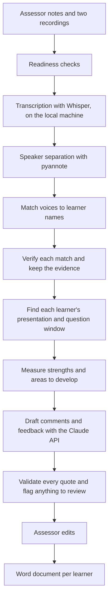

# Assessment Record Generator

A Python web app that turns two audio recordings of a spoken English assessment into a drafted assessment record for each learner, ready for the assessor to review, edit and sign off.

**This repository describes the project. The source code is private**, because it was built around real assessment work. I am happy to walk through the code in an interview.

## The problem

A Functional Skills English Level 2 assessment (Speaking, Listening and Communicating) has two parts: each learner gives a presentation, then the group holds a discussion. Afterwards the assessor writes a record for every learner, with a comment against 18 criteria and a feedback paragraph, each backed by what the learner actually said.

Writing these up from the recordings took me about 4 hours per session. The tool cut that to about 30 minutes, and the assessor still makes every judgement.

## What it does

1. The assessor uploads their notes and the two recordings.
2. The app transcribes the audio and works out who is speaking.
3. The assessor checks the transcripts and confirms which voice is which learner.
4. The app drafts each learner's record, quoting what they said.
5. The assessor edits the drafts and downloads one Word document per learner.

## How it works

## Engineering decisions

**Fail early, not 40 minutes in.** A long transcription used to fail late and quietly, for example when a graphics library was missing. Readiness checks now run before any work starts and say exactly what to fix.

**No invented evidence.** Every criterion is in one of three states: evidenced by a real quote from that learner, searched with nothing found (which goes to the assessor and never counts as a fail), or supplied by the assessor from their own observation. A quote that cannot be found in the right transcript, inside that learner's own speaking window, is rejected.

**Measure first, then ask the model.** Candidate moments, strengths and areas for development are found by ordinary code before the AI model is called. The model is given that evidence to write from, so it cannot make up what a learner said, and two learners do not get the same generic feedback.

**The same voice across two recordings.** Speaker separation numbers the voices from scratch in each file, so "speaker 1" in the presentation is not "speaker 1" in the discussion. The app matches voices across both recordings by their sound, and keeps a record of why it made each match.

**Validation that can block.** Checks after drafting return issues with a severity. Serious ones stop the download until they are fixed. Minor ones are flagged for the assessor.

**The record must survive.** Everything is stored in one SQLite database with JSON backups, so a record can be produced again if an external quality check asks for it.

## Testing and quality

- 330 automated tests across 18 test files, written with pytest
- Every change is linted, format-checked and tested by GitHub Actions
- Tests cover speaker verification, evidence rules, validators, document building, backup and session restore
- The prompt sent to the model is locked with a checksum, so it cannot change by accident

## Stack

| Part | Built with |
|---|---|
| Interface | Streamlit with a custom design system, light and dark |
| Transcription | faster-whisper (Whisper large-v3), GPU with a CPU fallback |
| Speaker separation | pyannote.audio |
| Drafting | Anthropic Claude API, one call per learner, with prompt caching |
| Documents | python-docx |
| Storage | SQLite with JSON backups |
| Quality | pytest, Ruff, GitHub Actions |

## Privacy

- The audio is transcribed on the assessor's own machine and is never uploaded.
- The transcript text is sent to the Claude API to draft the comments.
- Learner names, recordings, transcripts, documents and the database are excluded from version control. The repository holds source code only.
- The app is protected by a PIN.

## Size

- About 21,000 lines of application code
- About 4,600 lines of tests
- Set-up scripts that install, repair and update the app on a new PC with one command

## What I learned

- An AI model is one step in a pipeline, not the pipeline. The checks around it are what make the output trustworthy.
- Tests matter most where a wrong answer is costly. A record with a quote the learner never said is worse than no record.
- Good error messages save more time than clever code.

## Contact

Michael Ijisonuwe · [LinkedIn](https://uk.linkedin.com/in/michael-ijisonuwe-944657254) · ijisonuwe@outlook.com
